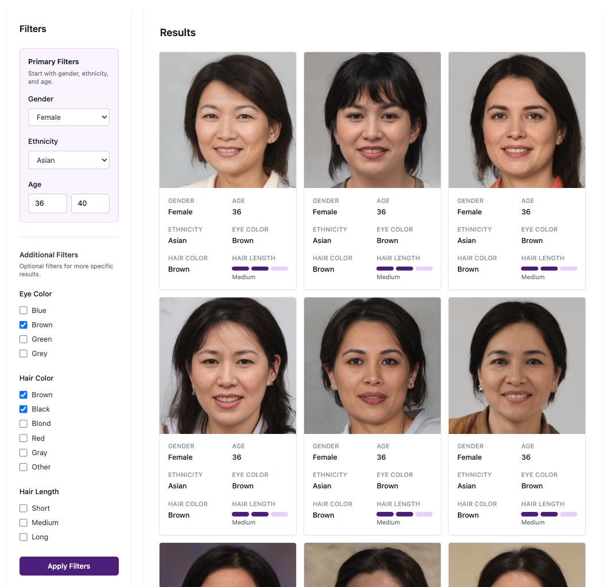
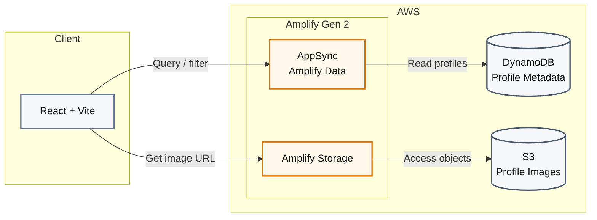

# AWS Amplify Gen 2 Gallery

Image gallery built with **React, Vite, AWS Amplify Gen 2, Amazon S3, and Amazon DynamoDB**.

Browse and filter AI-generated profiles using metadata stored in DynamoDB and images stored in S3.

> ⚠️ **All people shown are AI-generated.**



## DynamoDB Query Design

The profile data is stored in DynamoDB with a **Global Secondary Index (GSI)** designed around the gallery's primary filters using:

- **Partition key:** `Gender + Ethnicity`
- **Sort key:** `Age`

This allows the application to efficiently query profiles by gender and ethnicity while using age as the sort key for age-based filtering and ordering.

This index was chosen to match the gallery's most common filtering pattern while avoiding full-table scans as the dataset grows.

## Tech Stack

- **AWS Amplify Gen 2**
- **AppSync / Amplify Data**
- **Amazon DynamoDB**
- **Amazon S3**
- **React + Vite**
- **TypeScript**
- **Tailwind CSS**

## Architecture



## Dataset

Profile images and metadata are based on the **Generated Photos Academic Dataset**.

**Dataset:** [Generated Photos Academic Dataset on Kaggle](https://www.kaggle.com/datasets/generatedphotos/generated-photos-academic-dataset?utm_source=chatgpt.com)

Please refer to the dataset provider's terms and licensing before using the dataset.

## Running Locally

Download the dataset and migrate the profile data and images into your DynamoDB and S3 resources.

```bash
npm install
npm run dev
```

To run the local Amplify backend:

```bash
npx ampx sandbox
```

## Author

Jorge Donoso
